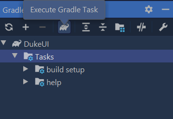

# Gradle Tutorial

Gradle is a _build automation tool_ used to automate build processes.
There are many ways of integrating Gradle into a project.
This project template uses the _Gradle wrapper_ approach.

* [Basics](#basics)
* [Adding Gradle to the Project](#adding-gradle-to-the-project)
* [Running Gradle Tasks](#running-gradle-tasks)
* [Adding Plugins](#adding-plugins)
  * [CheckStyle](#checkstyle)
  * [Shadow](#shadow)
* [Adding Dependencies](#adding-dependencies)
  * [JUnit](#junit)
* [Further Reading](#further-reading)

## Basics

You use a _build file_ (named `build.gradle`) to describes the project to Gradle. 
A build file mainly consists of _plugins_, _tasks_ and _properties_. 

* **Plugins** extend the functionality of Gradle. 
For example, the `java` plugin adds support for `Java` projects.

* **Tasks** are reusable blocks of logic.  
For example, the task `clean` simply deletes the project build directory. 
Tasks can be composed of, or dependent on, other tasks. 

* **Properties** change the behavior of tasks. 
For instance, `mainClassName` of the `application` plugin is a compulsory property which tells Gradle which class is the entrypoint to your application.
As Gradle favors [_convention over configuration_](https://en.wikipedia.org/wiki/Convention_over_configuration), there is not much to you need to configure if you follow the recommended directory structure.


## Adding Gradle to the Project

This project template already supports Gradle. No further actions are required.

If you followed the setup instructions given, IntelliJ IDEA will identify your project as a Gradle project and you will gain access to the `Gradle Toolbar`.
Through the toolbar, you run Gradle tasks and view your project's dependencies.



If the Gradle tasks don't appear in the Gradle window, click the 'refresh' button in the tooolbar to reimport the Gradle project.

## Running Gradle Tasks

To run a task, locate the task in the Gradle toolbar, right-click on a task, and choose `run`.

Alternatively, you can type the command in the terminal.

* On Windows: `gradlew <task1> <task2> …`​ e.g. `gradlew clean test`
* On Mac/Linux: `./gradlew <task1> <task2> …`​ e.g. `./gradlew clean test`


## Adding Plugins

Gradle plugins are reusable units of build logic. 
Most common build tasks are bundled into core plugins provided by Gradle. 
CheckStyle, Shadow, and JUnit are three plugins already added to this project.

### CheckStyle

CheckStyle is a tool for checking if the code complies with certain style rules.

Checkstyle expects configuration files for checkstyle (e.g., files that specify which style rules to follow) to be in `./config/checkstyle/` by convention.
A sample checkstyle rule configuration is provided in this project as well.

The plugin adds a few _tasks_ to your project.
* `checkstyleMain`: checks if the main code complies with the style rules
* `checkstyleTest`: checks if the test code complies with the style rules

For example, you can run `gradlew checkstyleMain checkstyleTest` to verify that all your code complies with the style rules.

**Resources**:
* [Gradle documentation for CheckStyle plugin](https://docs.gradle.org/current/userguide/checkstyle_plugin.html)

### Shadow

Shadow is a plugin that packages an application into an executable jar file. 

The plugin can be configured by setting some properties. 
By default, it produces a jar file with the name in the format of `{archiveBaseName}-{archiveVersion}.jar` (the two properties can be set in the `build.gradle` file).

You can generate an executable jar by running the command `gradlew shadowJar` which publishes an executable jar to `./build/libs/`.

**Resources**:
* [Gradle documentation for Shadow plugin](https://plugins.gradle.org/plugin/com.github.johnrengelman.shadow)
* [More about the Shadow plugin](https://imperceptiblethoughts.com/shadow/introduction/)


### JUnit

JUnit is a testing framework for Java. By convention, java tests belong in `src/test/java` folder. A sample test file is included in this project.

If you have imported your Gradle project into IntelliJ IDEA, you will notice that IDEA is able to mark the `src/test/java` folder as the _Test root_ (colored in green by default) automatically.

You can run a test (e.g., `test/java/seedu/duke/DukeTest.java`) by right-clicking on it and choosing `Run`.

**Resources**:
* [Gradle documentation for JUnit](https://docs.gradle.org/current/userguide/java_testing.html#using_junit5)


## Adding Dependencies

Gradle can automate the management of dependencies to third-party libraries. You just need to add the dependency into the `build.gradle` file and Gradle will do the rest.

For example, to add the Natty (a third-party library used for parsing natural lanaguage dates e.g., `today`), you simply have to add the following line to the `dependencies` section of the `build.gradle` file.
```groovy
compile group: 'com.joestelmach', name: 'natty', version: '0.6'
```

Tip: Most third-party libararies specify how to add it as a Gradle dependency ([example](https://mvnrepository.com/artifact/com.joestelmach/natty/0.6)).

## Further Reading

* [Official Gradle Documentation](https://docs.gradle.org/current/userguide/userguide.html)

----------------------------------------------------------------------------------------
**Authors:**
* Initial Version: Jeffry Lum
